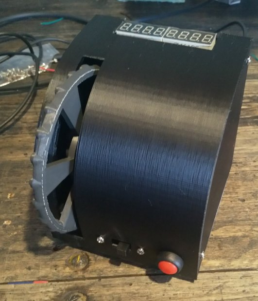

# Elevator Trim Wheel

I could not purchase a Saitek [Cessna Trim Wheel](https://www.amazon.com.au/Saitek-Flight-Cessna-Trim-Wheel/dp/B0058FAFI4) for love or money, so I thought I'd build one myself.

Features:

- appears as a Joystick/Game controller with a single axis;
- spin the wheel up or down to set axis value from -1000 through +1000;
- reset to 0 on button press;
- slide-switch to disable changing input;

These are used by flight-simmers to [trim their virtual aircraft](https://en.wikipedia.org/wiki/Trim_tab) so that they do not have to apply constant pressure to the flight yoke or joystick.

Required components:

- an [Arduino Leonardo](https://core-electronics.com.au/arduino-leonardo.html)
- [DF Robot SEN0230](https://core-electronics.com.au/incremental-photoelectric-rotary-encoder-400p-r.html) 400 P/R rotary encoder with bracket
- a 8 character 7-Segment LED display with a MAX7219 driver
- a monentary switch and DPST slide switch to suit
- various short jumper leads
- a handful of m3, m5 and m8 nuts, bolts and washers
- rough adhesive tape to enhance grip of the clamp

# 3D Prints

Use Openscad, your slicer and printer to render and then print one of each object in `scad/FauxtekElevatorTrim.scad`.

Use Openscad, your slicer and printer to render and then print the `scad/wheel-handle.scad`.

# Arduino Firmware

This project uses [Arduino-Makefile](https://github.com/sudar/Arduino-Makefile) to build, flash and test the Arduinos.

On Linux, install Arduino-Makefile then run `make upload` to flash your Arduino.

# Windows

Install the [Arduino IDE](https://www.arduino.cc/en/Guide/ArduinoLeonardoMicro#toc2) which installs the required drivers.

After installing the drivers and flashing the Arduino, it will appear as a game controller with a single axis and two buttons.

# FlightGear

Pre-made bindings are at `flightgear/cgspeck/Elevator-Trim-Wheel.xml`.
